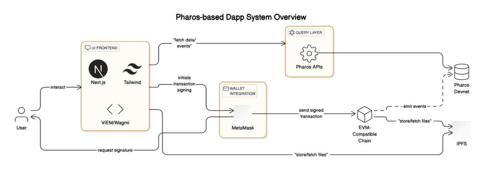

# Delivery-Tracker

##  “Track your parcels... on-chain.”

## 🧠 Concept:
An app where e-commerce companies (or individuals) can register package shipment details on-chain, and users can track their delivery progress transparently using Pharos.

Yes, it’s like a Web3-powered Speed Post / DTDC / BlueDart, but more transparent and verifiable.

## 🔍 Why it’s useful?
In real life, people wait for packages every day.

Current systems are opaque: delays, lost parcels, fake delivery updates.

With blockchain, every shipment status update is permanently recorded and auditable.

Pharos can index this data and offer a clean, trustless UI.

## 📦 Use Flow:
📤 Seller registers shipment on-chain (tx includes: sender, receiver, package ID, status).

🛻 Delivery updates (e.g., “Out for delivery”, “Reached warehouse”) are recorded via smart contract events.

🔍 User enters their Tracking ID into your app to view real-time status.

✅ Final delivery is signed by receiver via wallet or OTP (optional Web2 fallback).

📊 Extra: Add delivery speed stats, average delay by area, etc. using Pharos analytics.

## 🧰 Tech Stack:
Frontend: Next.js + Tailwind (clean UI)

Blockchain: Solidity for shipment smart contract

Data Layer: Pharos to index all shipment events

Notifications: Push Protocol / Email

Login: Wallet or Email (Web3 + Web2 hybrid)

## 🌍 Real-world Use Cases:
Local courier businesses can use it for transparent tracking.

Artists selling physical NFTs (prints, merch) can attach this for verifiable delivery.

Buyers can verify if the seller actually shipped or faked it.
